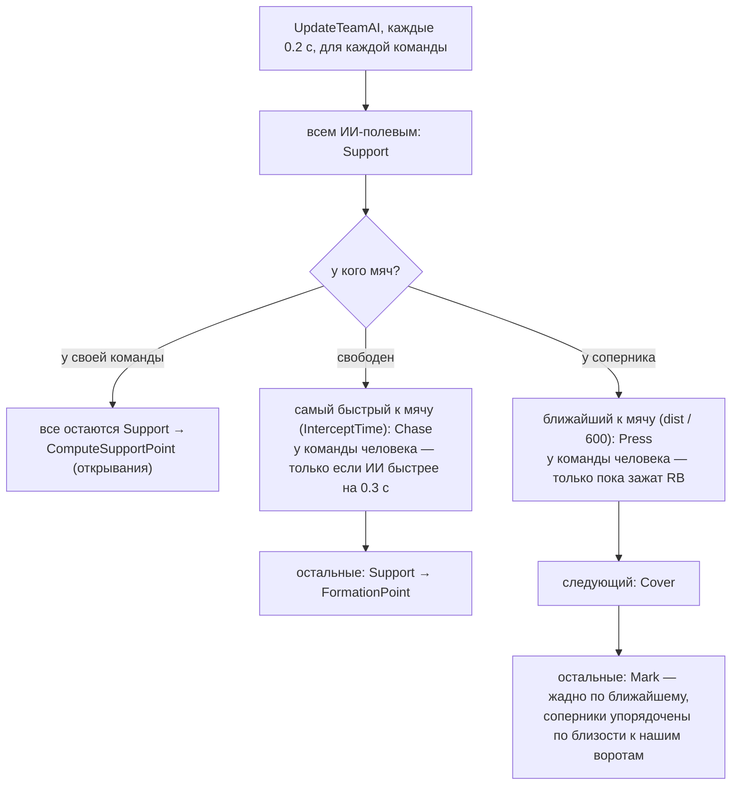

# ИИ полевых игроков: как устроен сейчас и план доработки

Цель игры: простой и понятный аркадный футбол 5×5 по принципу «easy to learn, hard to master».
Жалобы из плейтеста:
1. нападающему трудно отдать пас;
2. игроки иногда сбиваются в кучу;
3. структура команды теряется.

Документ описывает текущий код и не меняет его. Строки указаны для `Source/MiniFootball/Soccer.cpp`
на коммите `e8a48cf`. Поле 48×32 м: `HalfLength = 2400`, `HalfWidth = 1600`, все расстояния в см.
Команда 0 атакует в сторону +X, `S = AttackSign()` (±1).

---

## 1. Как работает ИИ сейчас

### 1.1 Два уровня

| Уровень | Где | Как часто | Что делает |
|---|---|---|---|
| Роли команды | `ASoccerGameMode::UpdateTeamAI` (6288–6381) | каждые 0.2 с (`TeamAITimer`, 6661–6666) | раздаёт каждому ИИ-полевому роль `Support / Chase / Press / Cover / Mark` |
| Поведение игрока | `ASoccerPlayer::TickFieldAI` (2030–2189) | каждый кадр | исполняет роль, если её не перебил один из приоритетов ниже |
| Игрок с мячом | `TickAIWithBall` (2687–2730) → `DecideWithBall` (2597–2639) | раз в 0.55 / 0.4 / 0.28 с × (0.8–1.2), в зависимости от сложности | выбор между ударом, пасом, ведением и финтом |

Игрок, которым управляет человек, в раздаче ролей не участвует (6304). Вратари — тоже, у них отдельный `TickGoalkeeper`.

### 1.2 Схема раздачи ролей (`UpdateTeamAI`)



### 1.3 Что делает каждая роль (варианты по умолчанию)

| Роль | Точка / действие | Числа | Строки |
|---|---|---|---|
| **Chase** | бег на точку перехвата (`InterceptTime`) | спринт × 0.97 | 2110–2118 |
| **Press** | точка сдерживания `Ball + ToGoal·Gap + CarrierVel·0.25`, в удачный момент — отбор | вариант B: `Gap = 550`, +100 в первую секунду после приёма; ближе 12 м к своим воротам — 180; через 2–3.5 с «стояния» с мячом Gap плавно уходит к 350, после 4 с — 90. Отбор при дистанции < 125, подкат при 125–260 | 2193–2268 |
| **Cover** | на линии «мяч → свои ворота», **в 4 м от мяча** | 400 | 2122–2135 |
| **Mark** (B) | `Lerp(Opp + 350 к своим воротам + 80 к мячу, FormationPoint, 0.5)` | A: 120 + 60 без зоны; C: 220, зона 0.25 | 2136–2165 |
| **Support**, мяч у своих | `ComputeSupportPoint`, точка пересчитывается раз в 0.8–1.3 с (при рывке за спину — 1.8 с) | спринт, если до точки > 450 | 2166–2180 |
| **Support**, мяч не у своих | `FormationPoint = Home + (0.45·BallX, 0.25·BallY)`, +300 вперёд, если мяч у своих | отступ от линий 150 | 2016–2028, 2181–2185 |

Расстановка `Home` (1-2-2) задаётся в `SpawnTeams` (5086–5092): вратарь (−2330, 0), защитники (−1380, ±540),
нападающие (−540, ±420). У команды 1 всё зеркально по X.

Приоритеты в `TickFieldAI` перебивают роль в таком порядке:
1. есть мяч (2036);
2. стандарт соперника → держать 5.2 м (2057);
3. свой угловой → забегания в штрафную (2063);
4. мяч в воздухе рядом → игра головой (2082);
5. мяч в руках у вратаря соперника → вернуться в формацию (2092);
6. пас адресован мне → бежать навстречу (2099).

### 1.4 Открывания: `ComputeSupportPoint`, вариант B (2290–2395)

1. `LastLine` — самый глубокий полевой игрок соперника по оси атаки (2302–2304).
2. `Rank` — сколько партнёров (без владельца мяча и вратаря; человек считается) стоят дальше меня по X (2312–2315).
   Ранг каждый игрок считает сам, в свой момент пересчёта.
3. Базовая точка зависит только от ранга:
   - **Rank 0** («впереди»): `X = min(max(Ball + 700, LastLine − 80), HalfLength − 350)`, `Y = −0.3·BallY`.
     С вероятностью 50% (жребий `FRand() < 0.5`, если соперник не ближе 1.8 м к мячу) — рывок за спину:
     `X = min(max(LastLine + 300, Ball + 900), Ball + 1700, HalfLength − 350)` (2320–2331).
   - **Rank 1** («дальняя бровка»): `(Ball + 250, −sign(BallY)·(HalfWidth − 250))` (2332).
   - **Rank ≥ 2** («страховка сзади»): `(Ball − 650, 0.3·BallY)` (2333).
4. Для Rank 0 добавляется альтернатива «показаться ближе»: `(Ball + 650, BallY ± 350)` (2355–2357).
5. Проверяются 10 или 20 случайных кандидатов в радиусе ±200 от базовой точки. Оценка (2384–2385):
   `Space/450 + LaneOpen/250·1.2 + прогресс·(0.5 для номеров 3–4, иначе 0.2) − дистанция/2500 − Crowd`.
   `Crowd` учитывает партнёров, которые **сейчас** стоят ближе 350 к кандидату (2379–2382).

### 1.5 Игрок с мячом

- `DecideWithBall` (2597–2639):
  - удар, если `ShotScore > 0.45` и `ShotScore ≥ PassScore − 0.1`;
  - пас, если `PassScore > 0.25` и `PassScore > DribbleScore`.
  - При темпе B `DribbleScore = 0.55·clamp(SpaceAhead/600)·0.9 − 0.25·clamp(OnBall − 1, 0, 2)`, то есть чем дольше игрок держит мяч, тем охотнее отдаёт.
  - Партнёру, который бежит за спину, +0.2.
- `EvaluatePass` (2509–2553): пас рассматривается на дистанции 2.5–24 м.
  - `Safety` — запас по времени против самого быстрого перехватчика: соперник бежит 600 см/с и достаёт на 70 см.
  - `Open` — свободное место у точки приёма.
  - `Progress` — продвижение к воротам.
- Пас человека (`PlanPass`, 3143–3216) при варианте «ПАС НИЗОМ» = C: адресат — партнёр в конусе ±40° по стику (3154).
  Мяч летит в `MateLoc + MateVel·0.4` (3164), то есть туда, куда партнёр бежит **сейчас**.

### 1.6 `SoccerVariants`, связанные с ИИ (111–228)

| Действие | Значение по умолчанию (`GValues`, 123) | Что значит |
|---|---|---|
| `Support` (ОТКРЫВАНИЯ) | **B** — «ширина и глубина» | ранги по X (см. 1.4); A — по номеру в составе, C — треугольники вокруг мяча |
| `Defense` (ОБОРОНА) | **B** — «как в Goals» | Press держит 5.5 м, опека зонами; A — плотно 1.3 м, C — 2.6 м |
| `Tempo` (ТЕМП ИИ) | **B** — «как в Goals» | чем дольше держит мяч, тем чаще пасует |
| `Pass` (ПАС НИЗОМ) | **C** | пас человека по стику, без разброса |

Важно для плейтеста:
- выбранные варианты сохраняются в `GameUserSettings.ini`, секция `MiniFootball.Variants` (`Load`, 213–227), поэтому у тестера могут быть не те значения, что по умолчанию;
- крестовина сейчас переключает только «ПАС НИЗОМ» (`OnVariantAction`, 4191–4197). ИИ-варианты меняются только из консоли: `mf.Var.Support`, `mf.Var.Defense`, `mf.Var.Tempo`.

---

## 2. Проблемы

### П1. Press и Cover стоят на одной линии, причём Cover ближе к мячу

- **Строки:** Press, `HoldOff[1] = 550` и точка сдерживания (2219–2226); Cover — 400 от мяча (2124–2125).
- **Механизм:** в варианте B оба игрока стоят на линии «мяч → наши ворота»: Press в 5.5 м от мяча (6.5 м в первую секунду после приёма), Cover — в 4 м.
  После 2–3.5 с «стояния» с мячом Press подходит на 3.5 м, Cover остаётся на 4 м, и между ними всего 0.5 м.
- **Что видно:**
  - двое защитников стоят друг за другом — это та самая «куча»;
  - за ними пустота, никто не страхует ни фланг, ни второй пас;
  - центральная линия паса вперёд перекрыта сразу двумя игроками.

  В варианте A (`Gap = 130`) порядок был правильный: Press в 1.3 м, Cover в 4 м. Вариант B сломал это соотношение.

### П2. Слоты открываний сталкиваются: два игрока бегут в одну точку

- **Строки:** ранг (2312–2315), базовые точки (2320–2333), пересчёт по таймеру (2172–2175), `Crowd` (2370–2383).
- **Механизм:** каждый ИИ считает свой `Rank` сам и в свой момент (таймер 0.8–1.3 с, случайный у каждого).
  Базовая точка ранга одна для всех, кто этот ранг получил, — от игрока она не зависит.
  Пока игроки обгоняют друг друга по X (мяч быстро идёт вперёд, дальний фланговый оказывается впереди нападающего), до ~1.3 с двое одновременно считают себя Rank 0 или Rank 1 и бегут в одну точку.
  `Crowd` видит только тех, кто **уже** стоит в радиусе 3.5 м, а не тех, кто туда бежит.
  «Дальняя бровка» к тому же переворачивается, как только мяч пересекает `Y = 0` (2332), и игрок бежит через всё поле, 27 м поперёк.
- **Что видно:** двое сходятся в одну зону, а потом одновременно разбегаются.

### П3. Нападающий стоит «на плече» опекуна и за двумя защитниками, а его цель скачет

- **Строки:** точка Rank 0 `LastLine − 80` (2322); жребий рывка (2324); чередование с «показаться ближе» (2355–2366); Mark B (2147–2154); упреждение паса человека (3164).
- **Механизм, петля «нападающий ↔ опекун»:** нападающий встаёт на 80 см перед последним защитником.
  Опекун по варианту B ставит себя относительно нападающего: `Lerp(Xs + 350 − 80, FormationX, 0.5)`, а значит, и сама `LastLine` зависит от нападающего.

  Пример: мяч в центре `(0, 0)`, у защитника команды 1 `FormationX = 1380`.
  - Опекун: `0.5·Xs + 825`.
  - Нападающий: `max(700, 0.5·Xs + 745)`.
  - Равновесие: нападающий на **X ≈ 1490**, опекун на **1570** (в 0.8 м сзади).
  - Пас длиной ~15 м идёт по оси `Y = −0.3·BallY = 0`, то есть ровно через Cover (X 400) и Press (X 550) из П1.
- **Нестабильная цель:** с вероятностью 50% нападающий уходит в рывок, иначе чередует «высокую» и «короткую» точку.
  Выбор пересчитывается каждые 0.8–1.3 с из 10–20 случайных кандидатов.
  Пас человека летит в `MateLoc + MateVel·0.4`: если нападающий развернулся в момент паса, мяч уходит мимо.
- **Нет реакции на прицел:** когда человек заряжает пас и на нападающем горит метка адресата (`AimReceiver`, 3975), нападающий не останавливается, не разворачивается к мячу и не уходит с линии перехвата.

### П4. Роли без гистерезиса: Press/Cover и опекаемые меняются каждые 0.2 с

- **Строки:** сортировка по времени до мяча (6317–6330), выбор первого (6332–6349), Cover (6352–6356), жадная опека (6358–6378), таймер 0.2 с (6661–6666).
- **Механизм:** роли раздаются заново каждые 0.2 с по текущим расстояниям.
  Если двое примерно на одинаковом расстоянии до мяча (разница меньше метра), Press и Cover меняются местами при каждом шаге владельца мяча.
  Опека жадная по ближайшему, поэтому когда соперники перебегают, опекуны меняются подопечными и пересекают траектории друг друга.
- **Что видно:** защитники «дёргаются» — разворачиваются туда-обратно. Строй плывёт, хотя каждое отдельное решение локально разумно.

### П5. Структура держится только на мгновенных рангах, переходы резкие

- **Строки:** ранги по X вместо номеров в составе (2296 используется только в варианте A и как вес 0.5/0.2 в 2384); человек считается в ранге (2313–2315); одновременная смена всех ролей (6311–6314); `FormationPoint` (2016–2028).
- **Механизм:**
  - Кто впереди, тот и нападающий: защитник, который продвинулся с мячом, остаётся «нападающим», а нападающий уходит в «страховку».
  - При потере мяча все 3–4 ИИ в один тик меняют `Support` на `Press / Cover / Mark` и бегут от атакующих точек к защитным. Отдельного правила «один всегда сзади» (rest defence) нет.
  - Страховка (Rank 2) есть, только если без мяча трое ИИ. Если владелец мяча — ИИ (ввод из аута, вратарь), а человек стоит глубже всех, страхующего ИИ нет.
- **Что видно:** после потери мяча команда долго собирается, центр пустой, контратака соперника идёт трое на двоих.

---

## 3. План итераций

### Общие правила

- **Одна итерация — одно изменение** за своей консольной переменной `mf.AI.<Имя>` (0 — как сейчас, 1 — новое).
  Переменные читаются каждый кадр, поэтому их можно переключать прямо в матче.
  После приёмки значение по умолчанию меняется на 1, старая ветка удаляется.
- Меняется только ветка варианта B (`Support` / `Defense` = 1). Варианты A и C не трогаем.
- **Проверка за 5 минут (протокол):**
  1. `mf.Intro 0`, матч 3 минуты, сложность «нормально».
  2. Первые 2 минуты — с `mf.AI.X 0`, следующие 2 — с `mf.AI.X 1`.
  3. Для метрик запускать с `mf.Trace 1` (логи `MFOPT` / `MFDBG`, 6545–6583).
  4. Для прогона без человека добавить `mf.BotsOnly 1`: играют десять ИИ.
- **Метрики `MFOPT`** считаются так же, как `analyse2.py` считает их по видео Goals, так что их можно сравнивать с Goals напрямую:

  | Метрика | Что значит |
  |---|---|
  | `open` | сколько партнёров на расстоянии 5–22 м с чистой линией паса (ни одного соперника ближе 1.5 м к линии) |
  | `ahead` | сколько из них впереди больше чем на 2 м |
  | `near` | расстояние до ближайшего партнёра |
  | `press` | расстояние до ближайшего соперника |
  | `width`, `depth` | ширина и глубина расстановки команды |

  Базовые значения нужно снять в итерации 0.

### И0. Инструменты (подготовка, игру не меняет)

1. **`mf.AIDebug 1`** — рисовать над каждым ИИ букву роли (`S / C / P / V` (Cover) `/ M`), ранг и точку, куда он бежит.
   ```cpp
   // ASoccerPlayer::Tick, после TickFieldAI; #include "DrawDebugHelpers.h"
   if (CVarAIDebug.GetValueOnGameThread() && !IsPlayerControlled() && !bGoalkeeper)
   {
       DrawDebugString(GetWorld(), GetActorLocation() + FVector(0,0,150), RoleLetter(AIRole) + FString::FromInt(LastRank), nullptr, TeamColor, 0.f);
       if (!SupportPoint.IsZero()) DrawDebugSphere(GetWorld(), SupportPoint, 30.f, 8, TeamColor, false, 0.f);
   }
   ```
2. **`Scripts/goals_tracking/optanal.py`** — разбор строк `MFOPT team T open O ahead A ... near N press P width W depth D`
   с выводом в той же строке, что и у `analyse2.py`:
   `open 1.4 | none 22% | 2+ 41% | ahead>=1 55% | press median 4.1 m | nearest mate 6.3 m`, отдельно по командам.
3. Снять базу: 2 прогона по 3 минуты с `mf.BotsOnly 1` и сохранить цифры в этот документ.

### И1. Cover за спиной у Press (П1) — `mf.AI.CoverDepth`

Cover всегда стоит на 2.5 м глубже Press.
```cpp
// вынести формулу Gap из TickPress (2219–2225) в float PressGap(const ASoccerPlayer* Carrier) const
case ESoccerAIRole::Cover:
    float Depth = 400.f;
    if (CVarAICoverDepth && DefVariant > 0 && Carrier && Carrier->Team != Team)
        Depth = FMath::Clamp(PressGap(Carrier) + 250.f, 400.f, float(FVector::Dist2D(BallLoc, OwnGoal)) - 150.f);
    Point = ClampToField(BallLoc + ToOwnGoal * Depth, 100.f);
```
- Числа: обычно Press 550 и Cover 800; у своих ворот 180 и 430; сразу после приёма 650 и 900.
- **Проверка:** в `mf.AIDebug` буквы P и V больше не стоят друг за другом ближе 2 м. 10 пасов вперёд через центр — сколько перехватил второй защитник: ожидаем меньше.
- **Метрика:** у команды человека растёт `ahead ≥ 1`, у команды ИИ `press` не меняется.

### И2. Место нападающего: 2.5 м перед последней линией и не на оси мяча (П3) — `mf.AI.StrikerSpot`

```cpp
// ComputeSupportPoint, Rank 0, «стоячая» точка вместо LastLine − 80 (2322–2323)
const float RestX = FMath::Min3(LastLine - 250.f, float(BallLoc.X * S) + 1100.f, HalfLength - 350.f);
const float AheadX = FMath::Max(float(BallLoc.X * S) + 500.f, RestX);
float Y = BallLoc.Y * -0.3f;
if (FMath::Abs(Y - BallLoc.Y) < 350.f)                     // не на линии мяч–ворота, где стоят Press и Cover
    Y = BallLoc.Y + (Me.Y >= BallLoc.Y ? 350.f : -350.f);
Base = ClampToField(FVector(S * AheadX, Y, 0.f), 150.f);
```
- Числа для примера из П3 (мяч в `(0, 0)`):
  - нападающий на `(1100, ±350)` вместо `(1490, 0)`;
  - до опекуна 2.75 м вместо 0.8 м;
  - пас ~11.5 м вместо ~15 м;
  - Press (550, 0) проходит в 1.7 м от линии паса, Cover (400, 0) — в 1.2 м (чтобы перехватить, нужно 0.85 м).
- **Проверка:** 10 пасов нападающему от центрального круга — сколько дошло (в итоговой статистике «Пасы / точные»).

### И3. Рывок за спину по ситуации, а не по жребию (П3) — `mf.AI.RunCue`

Жребий `FRand() < 0.5` (2324) заменяется условием, которое игрок может «прочитать».
```cpp
const bool bCarrierFacesGoal = Carrier && FVector::DotProduct(Carrier->GetActorForwardVector(), FVector(S, 0, 0)) > 0.4f;
const bool bLaneToRun = MinOppDistToSegment(BallLoc, RunPoint) > 150.f;
const bool bRun = Carrier && Carrier != this && Pressure > 250.f && bCarrierFacesGoal && bLaneToRun;
```
- Рывок держится 1.8 с, как сейчас. Если условие не выполнено — стоит на точке из И2 (или старой) и пересчитывает раньше, только если линия паса к нему закрылась: `LaneOpen < 100`.
- Это «hard to master»: игрок учится развернуться к воротам и выиграть 2.5 м, после чего нападающий гарантированно уходит в рывок.
- **Проверка:** стоя спиной к воротам 10 раз и лицом 10 раз посчитать, сколько раз нападающий побежал. Ожидаем ~0 из 10 и ~8 из 10.

### И4. «Показаться под пас», когда человек в него целится (П3) — `mf.AI.ShowForPass`

```cpp
// TickFieldAI, default-ветка, до пересчёта SupportPoint (2171)
const ASoccerPlayerController* PC = HumanPC();
if (CVarAIShowForPass && PC && PC->GetAimReceiver() == this && TeamHasBall())
{
    SupportTimer = FMath::Max(SupportTimer, 0.3f);               // пока в меня целятся, цель не меняется
    const ASoccerPlayer* Blocker = OpponentNearestToSegment(BallLoc, Me);
    if (Blocker && DistToSegment2D(Blocker->GetActorLocation(), BallLoc, Me) < 120.f)
        SupportPoint = ClampToField(Me + AwayFromLane(Blocker) * 150.f, 150.f); // шаг из тени соперника
    MoveTo(SupportPoint, RunSpeed * 0.6f);                         // 270 см/с — мяч успевает прилететь
    GetCharacterMovement()->bOrientRotationToMovement = false;
    FaceTowards(BallLoc, Dt);
    break;
}
```
- `AimReceiver` уже выставляется, пока человек держит кнопку паса (3975), и HUD рисует над адресатом метку.
- **Проверка:** те же 10 пасов, что в И2. Отдельно проверить, что метка и остановка адресата совпадают.

### И5. Слоты открываний раздаёт команда, а не каждый игрок сам (П2) — `mf.AI.Slots`

```cpp
// UpdateTeamAI, ветка «мяч у своей команды» (сейчас continue на 6315)
TArray<FVector> Slots = { AheadSpot, WideSpot, SafetySpot };        // формулы 2320–2333 (или И2)
if (OffBall.Num() == 4) Slots.Add(ShortSpot);                        // владелец мяча — вратарь: (Ball + 650·S, BallY ± 350)
// WideSpot: сторона меняется, только когда |BallY| > 300 (гистерезис вместо sign(BallY))
// SafetySpot: (Ball − 700·S, 0.3·BallY), но не глубже X·S = −HalfLength + 900
// Если человек без мяча, ему заранее отдаётся ближайший к нему слот, ИИ делят остальные
// Перебор перестановок (≤ 24): cost = Σ Dist2D(P, Slot) − (P->SupportSlot == slot ? 300 : 0)
for (i) OffBallAI[i]->SupportSlot = BestPerm[i];
```
- `ComputeSupportPoint` берёт `Rank = SupportSlot`, а не считает его сам (2312–2315). Кандидаты вокруг базовой точки оцениваются как раньше.
- **Проверка:** в `mf.AIDebug` у двух игроков не бывает одинакового ранга.
- **Метрика:** медиана `near` не меньше 5 м; доля замеров, где два партнёра ближе 3.5 м друг к другу, падает почти до нуля.

### И6. Расстояние между партнёрами считается по целям, а не по текущим позициям (П2) — `mf.AI.Spacing`

```cpp
// ComputeSupportPoint, цикл по кандидатам (2379–2382)
float D = FVector::Dist2D(P->GetActorLocation(), C);
if (!P->SupportPoint.IsZero()) D = FMath::Min(D, float(FVector::Dist2D(P->SupportPoint, C)));
if (D < 300.f) continue_candidate;                  // жёстко: вплотную к чужой цели не встаём
if (D < 600.f) Crowd += (600.f - D) / 600.f * 1.5f; // было: радиус 350, вес 1
```
- `SupportPoint` — приватное поле того же класса, поэтому доступ из `ComputeSupportPoint` к нему есть.
- Итерация независима от И5: помогает и без слотов.
- **Метрика:** та же, что в И5.

### И7. Роли «прилипают» (П4) — `mf.AI.StickyRoles`

```cpp
// в ASoccerGameMode: TWeakObjectPtr<ASoccerPlayer> LastFirst[2]; TMap<TWeakObjectPtr<ASoccerPlayer>, TWeakObjectPtr<ASoccerPlayer>> LastMarker[2];
// после сортировки ByTime (6325): прежний Press/Chase остаётся первым, если отстаёт не больше чем на 0.35 с (≈ 2 м при 600 см/с)
if (Prev && ByTime[PrevIdx].Key - ByTime[0].Key < 0.35f) Swap(ByTime[0], ByTime[PrevIdx]);
// опека (6363–6378): прежний опекун сохраняется, если он дальше нового ближайшего не больше чем на 300
if (PrevMarker in Free && Dist(PrevMarker, Rival) < BestDist + 300.f) BestIdx = IndexOf(PrevMarker);
```
- Плюс лог `MFROLE team T changes N` под `mf.Trace`: число смен роли за минуту.
- **Проверка:** смен ролей за минуту должно стать в 2–3 раза меньше, чем в базе. Визуально защитники перестают разворачиваться туда-обратно.

### И8. Страхующий становится Cover при потере мяча (П5) — `mf.AI.RestDefence`

```cpp
// UpdateTeamAI: запоминать, кто у команды T был Safety (SupportSlot или Rank 2), пока мяч у своих
// в тик, когда мяч перешёл к сопернику:
SafetyPlayer->SetAIRole(ESoccerAIRole::Cover); ForcedUntil[T] = Now + 1.0f; // 1 с его роль не пересчитывается
// Press выбирается из остальных как обычно
```
- **Проверка:** 5 специально потерянных мячей в центре — сколько раз сразу после потери в центре остаётся наш игрок, который стоит глубже мяча.
- **Метрика:** у команды соперника реже встречается `press > 8 м` в первые 2 с после перехвата.

### И9 (по желанию, после И5). Номер в составе как подсказка к слоту (П5) — `mf.AI.RosterSlots`

- В стоимость перестановки из И5 добавить −400 см, если защитник (номера 1–2) идёт в `Safety` / `Wide`, а нападающий (3–4) — в `Ahead` / `Short`.
- Игрок начинает узнавать «своих» нападающих: это easy to learn.
- **Проверка:** доля времени, когда номера 3–4 оказываются впереди номеров 1–2 при атаке (по `MFDBG`), должна вырасти.

---

## 4. Порядок и связи

| Итерация | Проблема | Жалоба из плейтеста |
|---|---|---|
| И1 CoverDepth | П1 | пас нападающему, толпятся |
| И2 StrikerSpot | П3 | пас нападающему |
| И3 RunCue | П3 | пас нападающему (глубина игры) |
| И4 ShowForPass | П3 | пас нападающему |
| И5 Slots | П2 | толпятся |
| И6 Spacing | П2 | толпятся |
| И7 StickyRoles | П4 | структура |
| И8 RestDefence | П5 | структура |
| И9 RosterSlots | П5 | структура, понятность |

Рекомендуемый порядок: **И0 → И1 → И2 → И4 → И3 → И6 → И5 → И7 → И8 → И9**.
Первыми идут самые дешёвые правки, которые прямо бьют по главной жалобе («трудно дать пас»). Затем расстояния между игроками и только потом структура.
Каждую итерацию можно откатить своей переменной, ни одна не требует другой (кроме И9, которой нужна И5).

## 5. Чего не делать

- Не добавлять новые варианты A/B/C для ИИ. После итераций лучше зафиксировать вариант B и убрать ветки A и C у `Support` и `Defense`: чем меньше режимов, тем проще настраивать и объяснять.
- Не вводить тактические настройки (прессинг, ширина, «ставка на контратаки») — для аркады это лишнее.
- Не делать ручные команды на рывок (как L1 в FIFA). Рывок по ситуации (И3) даёт ту же глубину без новой кнопки.
- Не увеличивать частоту `UpdateTeamAI`: проблема не в частоте, а в отсутствии гистерезиса (И7).
