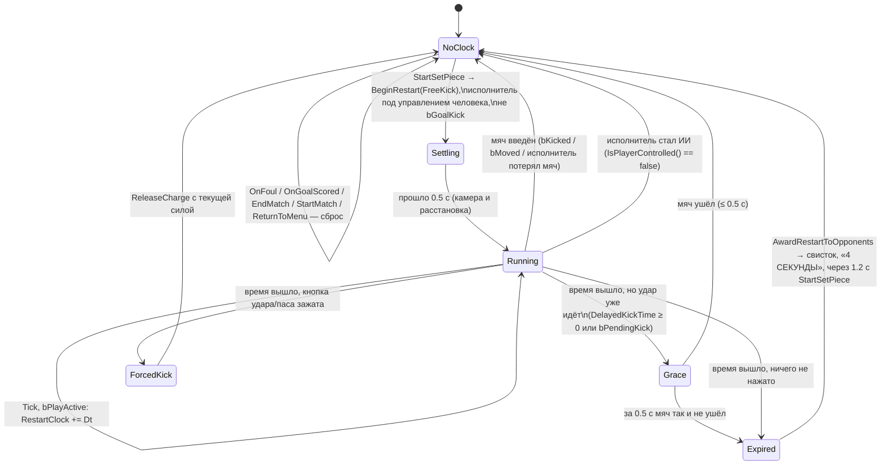

# Правило 4 секунд для стандартов человека и кольцо-таймер в HUD

Это проект, кода здесь нет. Он опирается на `docs/RULES_STATUS.md` (строка «4 секунды») и на решение владельца
проекта: **удар от ворот бьётся ногой, как в Goals (вариант Б)**.

Номера строк указаны для `Source/MiniFootball/Soccer.cpp` на коммите `e8a48cf`. Исправления из аудита (п. 1–13)
уже сделаны локально, но в этой ветке их нет. Там, где проект на них опирается, это отмечено как **[аудит #N]**;
названия в вашей версии могут отличаться.

---

## 1. Что делаем и чего не делаем

**Правило.** Человек, который исполняет **аут, угловой или штрафной**, должен ввести мяч за 4 секунды.
Иначе стандарт переходит сопернику:

| Стандарт человека | Что будет по истечении 4 с | Как в футзале |
|---|---|---|
| Аут | аут сопернику с той же точки | так же |
| Угловой | удар от ворот сопернику (ногой, вариант Б) | ввод мяча вратарём соперника |
| Штрафной | штрафной сопернику с той же точки | свободный удар; в игре непрямых нет |

**Кольцо-таймер.** Над меткой исполнителя рисуется кольцо из делений. Оно гаснет за 4 с, меняет цвет
от зелёного к красному и мигает в последнюю секунду.

**Не входит в правило** (часы не идут):

| Что | Почему |
|---|---|
| Разводка | в футзале на неё 4 секунд нет |
| Пенальти | в футзале нет; к тому же сначала нужно, чтобы вратарь стоял на линии |
| Удар от ворот | вариант Б: бьёт ИИ-вратарь через 1.2 с (`TickGoalkeeper` 2759–2768), человек им не управляет |
| Стандарты ИИ | ИИ и так бьёт через 0.8–1.6 с, см. раздел 5 |
| Аут вашей команды, который бьёт ИИ-партнёр (6095–6108) | ИИ не нарушает. Часы включаются, только если вы переключились на исполнителя |
| Тренировки (`IsPractice()`, `IsFreeTraining()`) | в «Ударах» у соперника нет полевых, отдавать стандарт некому |
| 10-метровый | его ещё нет. Когда появится — решить отдельно (по правилам это штрафной, 4 с есть) |
| Вратарь с мячом в руках: 6 → 4 с | другое правило (`TickHumanKeeper` 2899–2902), вынесено в раздел 8 |

---

## 2. Состояния

Часы — часть состояния стандарта в `ASoccerGameMode`. Отдельной сущности не нужно.



### 2.1 Новые поля и методы `ASoccerGameMode` (Soccer.h)

```cpp
// ---------- 4 секунды на стандарт человека ----------
public:
    // Доля оставшегося времени 1..0 для кольца в HUD; < 0 — часы не идут (кольцо не рисуется)
    float GetRestartClock01() const;
private:
    bool  IsClockedRestart() const;        // сейчас идёт стандарт, на который действуют 4 с (п. 3.1)
    void  TickRestartClock(float Dt);      // зовётся из Tick (п. 3.2)
    void  ResetRestartClock();             // RestartClock = 0, bRestartClockOn = false, ClockGrace = 0
    void  AwardRestartToOpponents();       // п. 4
    float RestartTimeLimit() const;        // 4 с; 5 с на лёгкой сложности; mf.RestartLimit
    bool  bRestartClockOn = false;
    float RestartClock = 0.f;              // сколько секунд исполнитель-человек стоит у мяча
    float ClockGrace = 0.f;                // запас на уже начатый удар
    static constexpr float ClockSettle = 0.5f;  // первые 0.5 с не считаются
    static constexpr float ClockGraceMax = 0.5f;
```

Консольная переменная `mf.RestartLimit` (float, по умолчанию 4, **0 — правило выключено**) нужна для
тестовых прогонов (`mf.TestCorner`, `mf.AutoShot`) и чтобы сравнивать «с правилом / без правила».

Часы считаются в игровом времени, `+= Dt` внутри `if (bInMatch && bPlayActive)` (6630). Поэтому пауза,
свисток и `!bPlayActive` их автоматически останавливают. `GetWorld()->GetTimeSeconds() − RestartStartTime`
для этого не подходит: в нём остаются секунды, пока игра стоит.

---

## 3. Функции и места изменений

### 3.1 `IsClockedRestart()` — на какие стандарты действуют часы

```cpp
bool ASoccerGameMode::IsClockedRestart() const
{
    const ASoccerPlayer* Taker = RestartTaker.Get();
    return Restart == ESoccerRestart::FreeKick        // аут, угловой, штрафной и удар от ворот идут как FreeKick
        && !bGoalKick                                  // удар от ворот — ИИ-вратарь, вариант Б
        && Taker && Taker->IsPlayerControlled()        // только человек
        && !IsPractice() && !IsFreeTraining()
        && RestartTimeLimit() > 0.f;
}
```

Разводка (`Kickoff`) и пенальти (`Penalty`) отсекаются по `Restart`. Флаги `bKickIn`, `bCorner` и `bGoalKick`
выставляет `StartSetPiece` после `BeginRestart` (6089–6094), и к первому тику часов они уже на месте.

### 3.2 `TickRestartClock(Dt)` — вызов из `ASoccerGameMode::Tick`

Встаёт сразу **после** блока «стандарт закончился» (6644–6659). Если мяч в этом кадре уже ввели,
`Restart` к этому месту уже `None`, и часы не сработают.

```cpp
void ASoccerGameMode::TickRestartClock(float Dt)
{
    if (!IsClockedRestart()) { ResetRestartClock(); return; }   // стандарт кончился или исполнитель стал ИИ
    if (!bRestartClockOn) { bRestartClockOn = true; RestartClock = -ClockSettle; }  // старт с «успокоения»
    RestartClock += Dt;
    if (RestartClock < RestartTimeLimit()) return;

    ASoccerPlayer* Taker = RestartTaker.Get();
    // 1) удар уже начат (замах по клипу или добегание до мяча): дать ему долететь
    if (Taker->IsKickInProgress())                               // DelayedKickTime >= 0 || bPendingKick
    {
        ClockGrace += Dt;
        if (ClockGrace < ClockGraceMax) return;
    }
    // 2) кнопка зажата: аркадная поблажка — ударить с текущей силой, а не наказывать
    else if (ASoccerPlayerController* PC = Cast<ASoccerPlayerController>(Taker->GetController());
             PC && PC->GetCharge() >= 0.f)
    {
        PC->ForceReleaseCharge();                                // == ReleaseCharge(Charging)
        return;                                                  // дальше — как обычный удар (или п. 1 на следующем кадре)
    }
    // 3) ничего не нажато (или удар «завис» дольше 0.5 с): стандарт сопернику
    AwardRestartToOpponents();
}
```

Новые маленькие публичные методы:

- `ASoccerPlayer::IsKickInProgress() const { return DelayedKickTime >= 0.f || bPendingKick; }` — оба поля сейчас приватные.
- `ASoccerPlayerController::ForceReleaseCharge() { if (Charging != ECharge::None) ReleaseCharge(Charging); }`.
  Идёт тем же путём, что отпускание кнопки. Вратарский и «первое касание» варианты для исполнителя с мячом не срабатывают:
  у него `HasBall()` (3917).

### 3.3 Сбросы часов

`ResetRestartClock()` вызывается там же, где сбрасывается состояние стандарта:

| Где | Строки | Зачем |
|---|---|---|
| `BeginRestart` | 6386–6397 | новый стандарт — часы с нуля |
| `OnGoalScored`, `OnFoul`, `EndMatch` | 5870, 5891, 6193 | там уже стоит `Restart = None` |
| `StartMatch`, `ReturnToMenu` | 4882, 4804 | рядом со сбросом `bPending*` **[аудит #9]** |
| сам `TickRestartClock` | — | стандарт кончился или исполнитель стал ИИ |

---

## 4. Что происходит по истечении: `AwardRestartToOpponents()`

Используется тот же путь, что у `CheckBallOut`: отложенный `StartSetPiece` через `ResetTimer`, флаги `bPending*`,
`SetPieceTaker` и `SetPieceSpot`. Хвост `CheckBallOut` (5969–5991) стоит вынести в общий метод, чтобы не дублировать:

```cpp
// общий хвост CheckBallOut и нарушения 4 с
void ASoccerGameMode::ScheduleSetPiece(int32 Team, const FVector& Spot, ESetPieceKind Kind, const TCHAR* Label, int32 AnnounceTeam);
// ESetPieceKind { KickIn, Corner, GoalKick, FreeKick } — выставляет bPendingKickIn / bPendingCorner / bOutOfPlayRestart,
// ищет исполнителя (GoalKick — вратарь Team, иначе ближайший полевой Team; нет — фолбэк [аудит #6]),
// bPlayActive = false, EventText = Label, EventBanner = 1.5, Whistle, SetTimer(ResetTimer, StartSetPiece, 1.2)
```

```cpp
void ASoccerGameMode::AwardRestartToOpponents()
{
    ASoccerPlayer* Taker = RestartTaker.Get();
    const int32 Other = 1 - Taker->Team;
    const FVector Spot = SetPieceSpot;
    // Какой стандарт сейчас: флаги StartSetPiece живы, пока Restart != None
    const bool bWasKickIn = bKickIn, bWasCorner = bCorner;

    Taker->Stun(0.f);                          // отпустить мяч, отменить замах и очередь ударов [аудит #8]
    Ball->ResetBall(Spot);                     // мяч остаётся на точке, никто им не владеет
    Restart = ESoccerRestart::None;  RestartTaker.Reset();  ResetRestartClock();

    if (bWasKickIn)
        ScheduleSetPiece(Other, Spot, ESetPieceKind::KickIn, TEXT("4 СЕКУНДЫ — АУТ"), Other);
    else if (bWasCorner)
    {
        const float EndSign = FMath::Sign(Spot.X);   // угловой бьют у ворот, которые защищает соперник
        ScheduleSetPiece(Other, FVector(EndSign * (HalfLength - 150.f), 0.f, BallRadius),
                         ESetPieceKind::GoalKick, TEXT("4 СЕКУНДЫ — ОТ ВОРОТ"), Other);
    }
    else
        ScheduleSetPiece(Other, Spot, ESetPieceKind::FreeKick, TEXT("4 СЕКУНДЫ — ШТРАФНОЙ"), Other);
}
```

Подробности:

- **Точка штрафного для соперника.** Точка та же, но стенка из `StartSetPiece` (6061) считает дистанцию до ворот
  *нового* исполнителя. Штрафной у ворот соперника превращается в его штрафной у своих ворот, далеко от ворот атакующих →
  стенки нет. Это правильно.
- **Удар от ворот после углового.** Точка и исполнитель — как в `CheckBallOut` (5961–5966): вратарь `Other`,
  `bGoalKick` → `bBallAtFeet` (вариант Б).
- **Аут сопернику.** Та же точка на бровке. Если аут теперь у вашей команды, срабатывает обычная логика
  «ИИ вводит, вам — ближайший партнёр» (6095–6108).
- **Управление.** `bPlayActive = false` → `Current()` возвращает `nullptr`, и `PlayerTick` сам снимает замах (3843–3847).
  Дальше `StartSetPiece` переключает управление как обычно.
- **Баннер и звук.** `EventText` и `EventBanner` 1.5 с, `PlaySfx(Whistle)`. В лог под `mf.Trace`:
  `MFRULE four-seconds team T kind K` — для проверки (раздел 7).
- **Статистика.** Фолом это не считается. При желании можно завести отдельный счётчик, но в `FSoccerMatchStats`
  его пока не добавляем.

---

## 5. Как не сломать ИИ-исполнителей

| Риск | Защита |
|---|---|
| ИИ-исполнитель (соперник или ваш партнёр на ауте) «просрочит» стандарт | Часы идут только при `Taker->IsPlayerControlled()` (п. 3.1). ИИ бьёт через `PrepareRestart` 1.3 / 1.6 с (6395, 6107). Его страховка `bGiveUp` через 8 с (6653) не меняется |
| Вы переключились (LB) на ИИ-исполнителя своего аута | Часы стартуют в этот момент с `−ClockSettle`, у вас полные 4 с. Переключиться на исполнителя нельзя, пока мяч у него: `OnLB` требует `!HasBall()` (4183) |
| Исполнитель перестал быть вашим (автопереключение) | `IsClockedRestart()` → `false` → часы сброшены. Дальше работает обычная логика ИИ (`TickAIWithBall` → `TakeRestart`) |
| ИИ-вратарь на ударе от ворот | `!bGoalKick` в п. 3.1 — часы не идут |
| Удар уже в полёте клипа (`KickAtContact`), а часы истекли | Запас `ClockGraceMax = 0.5 с` на `DelayedKickTime ≥ 0` или `bPendingKick` (п. 3.2). До штрафа дело не доходит |
| Истечение и удар в одном кадре | `TickRestartClock` стоит после проверки «стандарт закончился» (6654). Если `Ball->Kick` уже был, `Restart == None` и часы ничего не делают |
| Тестовые прогоны (`mf.TestCorner`, `mf.AutoShot`, `mf.BotsOnly`) | `mf.RestartLimit 0` выключает правило; при `mf.BotsOnly` исполнителей-людей нет |
| `bPending*` «переезжают» в следующий матч | Сброс в `StartMatch` / `ReturnToMenu` **[аудит #9]**; `AwardRestartToOpponents` ставит флаги только через `ScheduleSetPiece` |

---

## 6. Кольцо-таймер в HUD

### 6.1 Где рисовать

`ASoccerHUD::DrawHUD` (4228–4258). После метки игрока:

```cpp
const float Left = G ? G->GetRestartClock01() : -1.f;     // 1..0, < 0 — нет часов
if (Left >= 0.f)
{
    FVector2D C; float Size;
    if (G->IsFirstPersonCorner())
    {
        // на своём угловом метка над головой не рисуется (4252): кольцо — вокруг мяча
        const FVector B = Project(G->Ball->GetActorLocation());
        if (B.Z > 0.f) DrawRestartRing(FVector2D(B.X, B.Y), 0.045f * Canvas->ClipY, Left);
    }
    else if (GetTagAnchor(P, C, Size))
        DrawRestartRing(C, 0.95f * Size, Left);            // вокруг лаймовой точки над головой
}
```

`GetRestartClock01()` возвращает `-1`, если `!bRestartClockOn`. Во время «успокоения» (первые 0.5 с) —
`1` (кольцо полное). Дальше `1 − RestartClock / RestartTimeLimit()`, но не меньше 0.

### 6.2 Новые методы `ASoccerHUD` (Soccer.h)

```cpp
// Центр и размер метки над игроком (первые строки DrawPlayerTag, 4407–4418, вынесены без изменений)
bool GetTagAnchor(const ASoccerPlayer* P, FVector2D& OutCenter, float& OutSize);
// Кольцо из делений вокруг Center: Left 1..0 — сколько делений горит
void DrawRestartRing(const FVector2D& Center, float Radius, float Left);
```

`DrawPlayerTag` начинает вызывать `GetTagAnchor`. Поведение не меняется: считаются те же `Head`, `Feet`, `PH`, `W`,
просто в одном месте.

### 6.3 Как выглядит

```cpp
void ASoccerHUD::DrawRestartRing(const FVector2D& Center, float Radius, float Left)
{
    UTexture2D* Dot = GetTagTexture();                     // тот же сглаженный кружок, что у метки
    if (!Dot) return;
    constexpr int32 Ticks = 16;                            // 4 деления на секунду
    const float TickSize = FMath::Max(3.f, Radius * 0.28f);
    const int32 Lit = FMath::CeilToInt(Left * Ticks);
    // зелёный (как метка) → жёлтый → красный; в последнюю секунду мигает 4 Гц
    const FLinearColor Col = Left > 0.5f ? FMath::Lerp(FLinearColor(1.f, 0.85f, 0.f), FLinearColor(0.62f, 1.f, 0.05f), (Left - 0.5f) * 2.f)
                                         : FMath::Lerp(FLinearColor(1.f, 0.08f, 0.02f), FLinearColor(1.f, 0.85f, 0.f), Left * 2.f);
    const float Blink = Left < 0.25f ? 0.55f + 0.45f * FMath::Cos(GetWorld()->GetTimeSeconds() * 2.f * PI * 4.f) : 1.f;
    for (int32 i = 0; i < Ticks; ++i)
    {
        const float A = -PI * 0.5f + 2.f * PI * i / Ticks; // от 12 часов по часовой; гаснут против часовой, с конца
        const FVector2D P = Center + FVector2D(FMath::Cos(A), FMath::Sin(A)) * Radius;
        const bool bOn = i < Lit;
        DrawTexture(Dot, P.X - TickSize * 0.5f, P.Y - TickSize * 0.5f, TickSize, TickSize, 0, 0, 1, 1,
                    bOn ? Col * FLinearColor(1, 1, 1, Blink) : FLinearColor(0.1f, 0.1f, 0.1f, 0.5f), BLEND_Translucent);
    }
}
```

- 16 кружков вместо дуги: у Canvas нет примитива дуги, а в коде уже решили, что прямоугольники выглядят «пиксельным ромбом» (комментарий к `TagTexture`, `Soccer.h`:719).
- Цвет в начале — лаймовый, как метка человека: кольцо читается как часть метки, а не как новый элемент интерфейса.
- Кольцо рисуется, только пока идут часы, то есть только на стандарте человека. Метка адресата паса (белая) остаётся как есть.

### 6.4 Сообщение по истечении

`EventText` из п. 4 («4 СЕКУНДЫ — АУТ» и т. п.) показывает тот же баннер, что «ФОЛ!» / «АУТ»
(`SoccerUI::MakeHud`). Ничего нового в UI не нужно.

---

## 7. Проверка в игре (≈ 5 минут)

| Сценарий | Как вызвать | Ожидаем |
|---|---|---|
| Угловой, ничего не нажимать | `mf.Intro 0`, в матче `mf.TestCorner 1` | Кольцо вокруг мяча (вид от первого лица) гаснет за 4 с и мигает в последнюю секунду. Затем свисток, «4 СЕКУНДЫ — ОТ ВОРОТ», ИИ-вратарь соперника бьёт от ворот ногой |
| Штрафной, ничего не нажимать | `mf.TestCorner 2` | Кольцо над меткой; «4 СЕКУНДЫ — ШТРАФНОЙ», штрафной у соперника с той же точки, без стенки |
| Штрафной, держать A на 3.5 с | `mf.TestCorner 2` | На 4.0 с пас уходит с текущей силой, стандарт не переходит |
| Удар на 3.9 с | `mf.TestCorner 2`, нажать B на 3.9 с | Удар проходит (запас 0.5 с), штрафа нет |
| Аут вашей команды | вывести мяч в аут от соперника | Бьёт ИИ-партнёр, кольца нет. Если LB на исполнителя — кольцо появляется, полные 4 с |
| ИИ не нарушает | `mf.BotsOnly 1, mf.Trace 1`, 3 минуты | В логе нет `MFRULE four-seconds` |
| Правило выключено | `mf.RestartLimit 0` | Кольца нет, ваш исполнитель ждёт сколько угодно, как сейчас |
| Лёгкая сложность | матч на «лёгкой» | На кольцо 5 с |

---

## 8. Открытые вопросы и что сознательно отложено

1. **Сколько секунд на лёгкой сложности.** Предлагаю 5 с; на нормальной и сложной — 4 с, как в правилах.
2. **Поблажка «кнопка зажата — удар».** Это отход от правил ради аркадности: истечение посреди замаха воспринималось бы как «игра отняла мяч». Если нужна строгость — убрать ветку 2 из п. 3.2.
3. **Вратарь с мячом в руках: 6 → 4 с** (`TickHumanKeeper`, 2899–2902). В футзале это то же правило (контроль на своей половине). Предлагаю отдельной задачей и без наказания: кольцо вокруг метки вратаря и автопас в 4 с вместо 6 с. Кольцо переиспользует `DrawRestartRing`.
4. **10-метровый**, когда появится: включить его в `IsClockedRestart()` (по правилам это штрафной).
5. **Отдельный счётчик нарушений 4 с** в статистике — по желанию, не в первой версии.
